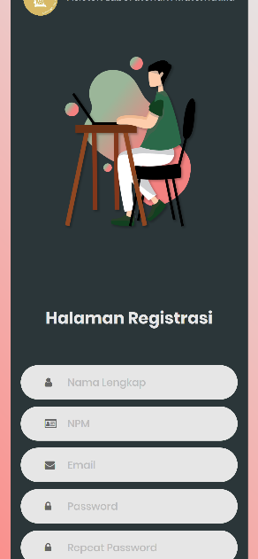

**4.1. Implementasi Sistem**

Desain dan perancangan yang telah dibuat kemudian direalisasikan ke
dalam pembuatan *website* absensi. Berikut adalah tampilan dari hasil
desain dan perancangan *website*.

**4.1.1. Halaman *Login***

Halaman yang pertama kali dilihat saat membuka *website*. Dapat langsung
login ketika sudah memiliki akun dan dapat mengklik register jika belum.
Selain itu jika ingin mengakses halaman lain namun belum login akan
diarahkan ke halaman login ini.

{width="4.8452066929133855in"
height="2.8923075240594924in"}{width="1.3384612860892389in"
height="2.8964720034995626in"}

**Gambar 4.1** Tampilan Halaman Login untuk PC dan mobile

**4.1.2. Halaman *Register***

Halaman untuk melakukan pembuatan akun.

{width="1.2769225721784776in"
height="2.764747375328084in"}{width="4.2615387139107614in"
height="2.7804330708661418in"}

**Gambar 4.2** Tampilan Halaman Register untuk PC dan mobile

**4.1.3 Halaman Lupa Password**

Jika lupa kata sandi dapat mengunjungi halaman ini.

{width="6.268055555555556in"
height="3.1631944444444446in"}

**Gambar 4.3** Tampilan Halaman Lupa Password

**4.1.4 Tampilan Email Verifikasi**

Setelah melakukan pendaftaran, perlu melakukan verifikasi email dengan
cara membuka email dan akan muncul tampilan seperti berikut.

{width="3.446153762029746in"
height="4.178126640419947in"}

**Gambar 4.4** Tampilan Email Verifikasi

**4.1.5 Tampilan Email Reset Password**

Tampilan Email saat ada permintaan reset password.

{width="4.815384951881015in"
height="4.1616797900262466in"}

**Gambar 4.5** Tampilan Email Reset Password

**4.1.6 Tampilan Halaman Untuk Mengganti Password**

{width="6.268055555555556in"
height="3.1631944444444446in"}

**Gambar 4.6** Tampilan Web untuk mengganti password

**4.1.7 Tampilan Email Saat Akun Diaktifkan atau Dinonaktifkan Admin**

{width="2.4863713910761156in"
height="3.214155730533683in"}{width="2.8447419072615925in"
height="3.2153849518810147in"}

**Gambar 4.7** Tampilan Email Saat Akun Diaktifkan atau Dinonaktifkan
Admin

**4.1.8 Halaman User**

Halaman halaman user juga dapat diakses oleh admin

**4.1.8.1. Sidebar yang Dapat Diakses Mahasiswa**

Mahasiswa hanya memiliki akses yang terbatas tidak seperti admin yaitu
hanya pada halaman halaman berikut. Namun menu user juga dapat diakses
admin

{width="2.8384612860892386in"
height="2.785896762904637in"}

**Gambar 4.8** Sidebar yang dapat diakses oleh user biasa.

**4.1.8.2. Halaman Utama User**

Halaman yang akan muncul setelah login sebagai user. Akan muncul daftar
matakuliah yang diikuti, selain mata kuliah yang diikuti tidak muncul.
Kemudian terdapat akses tombol menghadiri absen dan izin absen. Setelah
waktu tiga menit maka tombol akan berubah menjadi terlambat hadir.
Terdapat juga detai lmengenai mata kuliah dan pertemuannya serta tabel
kehadiran

{width="4.416903980752406in"
height="3.710657261592301in"}
{width="1.3923075240594927in"
height="3.720089676290464in"}

**Gambar 4.9** Halaman utama untuk user Tampilan PC dan mobile.

**4.1.8.3. Halaman Profile**

Halaman yang memunculkan detail prifile

{width="6.0532053805774275in"
height="3.0970199037620296in"}

**Gambar 4.10** Halaman Profile.

**4.1.8.4. Halaman Ubah Profil**

Dapat digunakan untuk mengganti nama dan foto profil.

{width="6.268055555555556in"
height="3.2069444444444444in"}

**Gambar 4.11** Halaman Ubah Profile.

**4.1.8.5. Halaman Ubah Password**

{width="6.268055555555556in"
height="3.2069444444444444in"}

**Gambar 4.12** Halaman Ubah Password.

**4.1.8.5. Halaman Izin**

Halaman ketika memilih izin maka ditujukan untuk mengupload surat izin.

{width="2.731101268591426in"
height="2.676923665791776in"}

**Gambar 4.13** Halaman Upload Surat Izin.

**4.1.8.5. Halaman Menghadiri Kelas**

Untuk menghadri kelas diperlukan untuk scan QR code yang disediakan.
Kamera mengarah ke qr code maka langsung menuju halaman utama dan status
berubah menjadi hadir.

{width="2.169712379702537in"
height="4.698240376202975in"}

**Gambar 4.14** Halaman Scan QR.

**4.1.9 Halaman Admin**

Halaman Admin tidak dapat diakses user, jika user mengakses halaman
admin maka akan muncul error akses tidak diizinkan.

{width="4.569230096237971in"
height="1.670556649168854in"}

**Gambar 4.15** Halaman Akses Dilarang.

{width="4.6in"
height="1.6818088363954506in"}

**Gambar 4.16** Halaman Tidak Tersedia.

**4.1.9.1 Halaman Utama Admin**

Akan ditampilkan semua mata kuliah dan kelas yang tersedia di dalam
halaman utama admin.

{width="4.453846237970254in"
height="3.6006780402449694in"}

**Gambar 4.17** Halaman Utama Admin.

**4.1.9.2 Halaman Manajemen User**

Halaman yang digunakan untuk mengaktifkan user oleh admin serta
menonaktikan user atau menghapus user.

{width="6.268055555555556in"
height="3.2069444444444444in"}

**Gambar 4.18** Halaman Manajemen User.

**4.1.9.3 Halaman Role**

Halaman Jika ingin menambahkan role baru seperti pengajar.

{width="6.268055555555556in"
height="3.2069444444444444in"}

**Gambar 4.19** Halaman Role.

**4.1.9.3 Halaman Manajemen Kelas**

Halaman untuk menghapus dan menambahkan kelas baru.

{width="6.268055555555556in"
height="3.2069444444444444in"}

**Gambar 4.20** Halaman Manajemen Kelas.

{width="6.268055555555556in"
height="3.1631944444444446in"}

**Gambar 4.21** Form Untuk menambahkan kelas.

**4.1.9.4 Halaman Manajemen Mata Kuliah**

Halaman untuk menghapus dan menambahkan mata kuliah.

{width="6.268055555555556in"
height="3.2069444444444444in"}

**Gambar 4.22** Halaman manajemen mata kuliah.

{width="6.268055555555556in"
height="3.1631944444444446in"} **Gambar 4.22** Form Untuk menambahkan
matakuliah.

**4.1.9.5 Halaman Menambah Menu Untuk Sidebar**

Halaman untuk menambah kelompok menu baru di sidebar jika ingin menambah
fitur baru.

{width="6.268055555555556in"
height="3.2069444444444444in"}

**Gambar 4.23** Halaman Manajemen Menu.

{width="6.268055555555556in"
height="3.2069444444444444in"}

**Gambar 4.24** Halaman Manajemen Submenu.

**4.1.9.6 Halaman Dashbor Kelas**

Di halaman ini terdapat QR code yang berubah ubah setiap pertemuan. Dan
jumlah mahasiswa yang menghadiri pertemuan akan muncul disini. Ada juga
grafik kehadiran mahasiswa dan data mahasiswa yang mengikuti mata kuliah
ini.

{width="5.393319116360455in"
height="8.207692475940508in"}

**Gambar 4.25** Halaman Utama Kelas.

Untuk menambahkan mahasiswa ke dalam kelas dapat melalui form di bawah
ini dengan mengklik checkbox dan dapat pula mancari nama praktikan. NPM
diurutkan dari yang terkecil agar memudahkan pencarian.

{width="6.268055555555556in"
height="3.1631944444444446in"}

**Gambar 4.26** Formulir menambah mahasiswa.

Berikut adalah formulir untuk menambah pertemuan juga untuk menampilkan
QR code baru agar bisa discan oleh mahasiswa.

{width="6.268055555555556in"
height="3.1631944444444446in"}

**Gambar 4.27** Formulir menambah pertemuan.

**4.1.9.7 Halaman Detail Mahasiswa**

Halaman untuk memunculkan daftar mahasiswa yang hadir. Serta dapat
dimunculkan pula lokasi mahasiswa mengisi daftar hadirnya.

{width="6.268055555555556in"
height="3.2069444444444444in"}

**Gambar 4.28** Daftar Mahasiswa Hadir.

{width="6.268055555555556in"
height="3.2069444444444444in"}

**Gambar 4.29** Lokasi Mahasiswa.

Ketika memilih eksport PDF maka akan mengambil data dan memunculkannya
sebagai berikut. Jika Excel maka akan mengunduh dalam format
excel.{width="6.268055555555556in"
height="3.1631944444444446in"}

**Gambar 4.30** Hasil Export PDF

**4.1.9.8 Halaman Daftar Kehadiran Mahasiswa**

Disini dimunculkan kehadiran mahasiswa tertentu dan mengikuti mata
kuliah apa saja.

{width="6.268055555555556in"
height="3.2069444444444444in"}

**Gambar 4.30** Daftar Hadir Mahasiswa.

**4.2 Evaluasi**

Pembuatan website absensi yang dijadikan sebagai sarana absensi online
ini mempunyai beberapa kelebihan dan kelemahan, antara lain sebagai
berikut:

**4.2.1 Kelebihan**

Dengan sistem absensi dari website absensi ini dapat mengantisipasi
mahasiswa yang ingin menitipkan kehadiran ke teman karena perlu QR code
yang hanya ditampilkan oleh pengajar. Dan lokasi dilakukannya pengisian
absen juga dapat diketahui oleh pengajar. Data Kehadiran mahasiswa juga
dapat diunduh oleh pengajar. Tampilan website yang *responsive* dan
mendukung penggunaan untuk *smartphone* juga mempermudah melakukan
pengisian absensi secara online.

**4.2.3 Kekurangan**

Harus menggunakan SSL agar dapat mengakses hardware tiap perangkat. Agar
website absensi ini terdeteksi aman oleh perangkat yang digunakan. Namun
tidak perlu khawatir karena jika sudah menggunakan domain berbayar maka
dapat dengan mudah mengaktifkan keamanan. Apalagi jika menggunakan
domain universitas.
